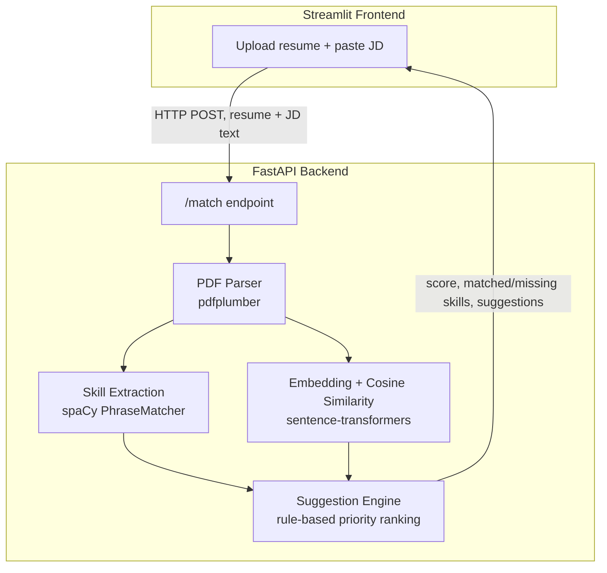

# Resume–JD Match Scorer

A tool that takes a resume (PDF) and a job description, and returns a semantic match score, a list of missing skills, and ranked, explainable suggestions on what to add to improve the match.

**Live demo:** https://resume-jd-matcher-app.streamlit.app/
**Backend API docs:** https://resume-jd-matcher-meki.onrender.com/docs

> ⚠️ The backend is hosted on Render's free tier, which spins down after 15 minutes of inactivity. The first request after idle time can take 30–60 seconds to wake up — this is expected, not a bug.

---

## Why this exists

Recruiters and ATS (Applicant Tracking Systems) filter resumes with keyword/semantic matching before a human ever reads them. A candidate with the right experience can still get filtered out simply because their resume is phrased differently from the job description. This tool closes that gap: paste a JD, upload a resume, and get back a concrete, prioritized list of what to change.

## What it does

1. **Match score (0–100%)** — semantic similarity between resume and JD, computed via sentence embeddings and cosine similarity (not just keyword overlap).
2. **Matched / missing skills** — extracted from a curated taxonomy of ~150 technical and soft skills using spaCy's `PhraseMatcher`.
3. **Ranked suggestions** — a rule-based priority engine scores each missing skill by JD term frequency, section placement (Requirements vs. Nice-to-have), and skill type (hard vs. soft), then surfaces the top 3–5 as plain-language, actionable advice.

## Architecture



**Why this approach:**
- **Embeddings over keyword matching** — captures synonymy (e.g. "ML Engineer" ≈ "Machine Learning Developer") that pure keyword overlap misses.
- **Curated skill taxonomy over free-form NER** — more precise and easier to defend/debug than a fully learned NER model with unpredictable failure modes.
- **Rule-based suggestion engine over an LLM wrapper** — every part of the ranking logic (priority formula, thresholds, templates) is something I designed and can explain line-by-line, rather than delegating the "intelligence" to an external model call.

## Tech stack

| Layer | Tool |
|---|---|
| Embeddings | `sentence-transformers` (`all-MiniLM-L6-v2`) |
| Skill extraction | `spaCy` `PhraseMatcher` + custom JSON taxonomy |
| Backend | `FastAPI` + `Uvicorn` |
| Frontend | `Streamlit` |
| PDF parsing | `pdfplumber` |
| Testing | `pytest` (62 tests across parsing, extraction, scoring, suggestions, API) |
| Containerization | `Docker` |
| Hosting | Render (backend) + Streamlit Community Cloud (frontend) |

## Running locally

**Backend:**
```bash
cd backend
python3.12 -m venv venv
source venv/bin/activate
pip install -r requirements.txt
python -m spacy download en_core_web_sm
uvicorn main:app --reload
```
API available at `http://localhost:8000`, interactive docs at `http://localhost:8000/docs`.

**Frontend:**
```bash
cd frontend
pip install -r requirements.txt
export BACKEND_URL=http://localhost:8000
streamlit run app.py
```

**Or via Docker (backend only):**
```bash
docker build -t resume-jd-matcher .
docker run -p 8000:8000 resume-jd-matcher
```

**Tests:**
```bash
cd backend
python3 -m pytest
```

## API

```
POST /match
  multipart/form-data: resume (PDF file), jd_text (string)
  → { score, matched_skills, missing_skills, suggestions }

GET /health
  → { "status": "ok" }
```

Full request/response schemas: `/docs` (Swagger UI, auto-generated from Pydantic models).

## Known limitations

- **Cold starts** — Render's free tier sleeps after 15 minutes of inactivity; first request afterward is slow.
- **No ground-truth evaluation for suggestions** — the match *score* was calibrated against a manually labeled set of resume-JD pairs, but there's no labeled dataset for "good resume advice," so the suggestion engine was evaluated qualitatively (manually reviewing output on the calibration set) rather than against a benchmark accuracy number.
- **Taxonomy-bounded skill detection** — only skills present in the curated taxonomy (~150 entries) can be detected. A skill genuinely relevant to a JD but absent from the taxonomy will silently not be picked up as matched or missing.
- **No LLM-generated suggestions (yet)** — the current suggestion engine is entirely rule-based by design (see "Why this approach" above). An optional LLM-enhanced suggestion mode, grounded via retrieval over real resume examples, is a planned future extension, not yet built.
- **English-only** — the spaCy model and skill taxonomy assume English-language resumes and job descriptions.

## Project structure

```
resume-jd-matcher/
├── backend/
│   ├── main.py                  # FastAPI app
│   ├── models/schemas.py        # Pydantic request/response models
│   ├── services/
│   │   ├── pdf_parser.py        # text extraction + section detection
│   │   ├── skill_extraction.py  # PhraseMatcher-based skill detection
│   │   ├── embedding.py         # cosine similarity scoring
│   │   └── matching.py          # suggestion engine
│   ├── data/skill_taxonomy.json
│   └── tests/
├── frontend/
│   └── app.py                   # Streamlit UI, pure HTTP client of the backend
├── Dockerfile
└── README.md
```

---

Built by [Sai Kiran Kanuri](https://github.com/saikiran-kanuri) — [repo](https://github.com/saikiran-kanuri/resume-jd-matcher)
